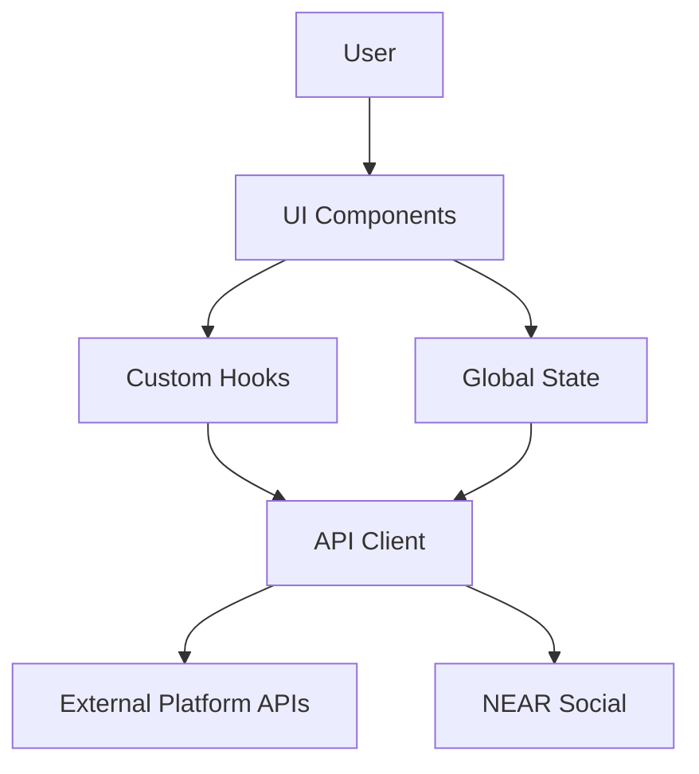
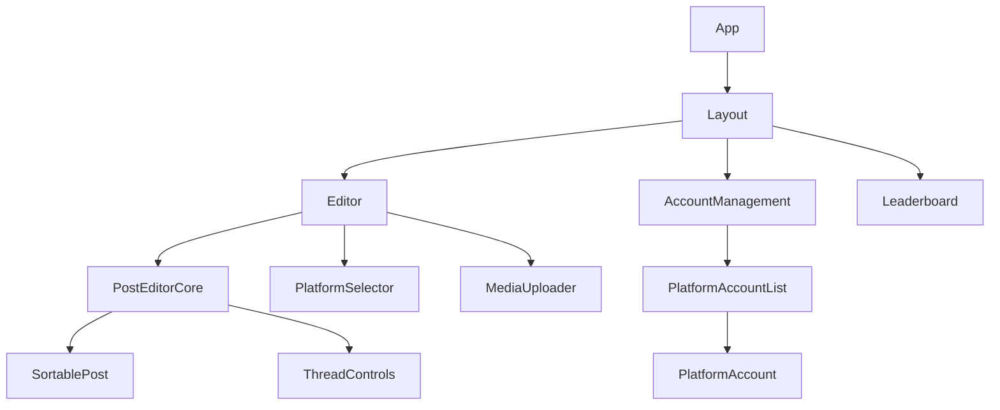
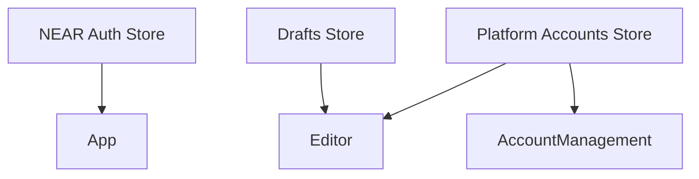

# System Patterns: Open Crosspost

## Architecture Overview

Open Crosspost follows a modern React application architecture with the following key patterns:

## Core Design Patterns

### 1. Component Composition
- **Atomic Design**: UI is built from small, reusable components that combine to form more complex interfaces
- **Composition over Inheritance**: Components are composed rather than extended
- **Container/Presentational Pattern**: Separation of data fetching/logic from presentation

### 2. State Management
- **Store Pattern**: Global state is managed in dedicated stores
- **Custom Hooks**: Encapsulate and reuse stateful logic
- **Context API**: Provide state to component trees without prop drilling

### 3. API Communication
- **Client Abstraction**: API interactions are abstracted through a client layer
- **Response Normalization**: External API responses are normalized to consistent formats
- **Error Handling**: Centralized error handling and reporting

### 4. UI Patterns
- **Toast Notifications**: Non-intrusive feedback for user actions
- **Modal Dialogs**: Focused interactions for complex tasks
- **Progressive Disclosure**: Show details on demand (e.g., error details)
- **Responsive Design**: Adapt to different screen sizes

## Component Architecture

### UI Component Hierarchy

### State Management

## Error Handling Strategy

### Error Categorization
- **API Errors**: Issues with external API communication
- **Validation Errors**: User input problems
- **Authentication Errors**: Permission/auth issues
- **Network Errors**: Connectivity problems

### Error Handling Patterns
- **Toast Notifications**: For immediate feedback
- **Contextual Error Display**: Show errors near relevant UI elements
- **Error Details Dialog**: For investigating complex errors
- **Retry Mechanisms**: For recoverable errors

## Reusable Patterns

### Toast Notification System
- **Success/Warning/Error Variants**: Visual distinction between message types
- **Action Buttons**: Allow users to take action directly from toasts
- **Auto-dismiss**: Non-critical messages auto-dismiss
- **Stacking**: Multiple notifications stack in order

### Error Details Component
- **Summary View**: High-level overview of errors
- **Detailed View**: Expandable sections for detailed error information
- **Actionable Errors**: Retry buttons for recoverable errors
- **Grouping**: Related errors are grouped together

### Platform-Specific Components
- **Platform Icons**: Consistent visual representation of platforms
- **Platform Cards**: Unified display of platform accounts
- **Platform-Specific Formatting**: Handle platform-specific content requirements
